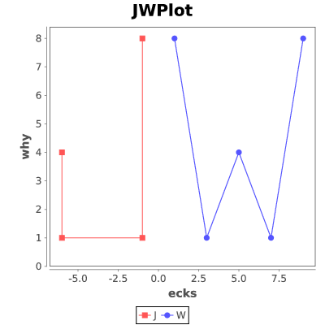

# jwplot

Plotter based on JFreeChart for simple, general-purpose plotting from
the shell

* [User guide](https://jmwozniak.github.io/jwplot)


## Example

Consider this JWPlot configuration file (Java properties format):

*examples/lines/jw.cfg*
```
title = JWPlot
xlabel = ecks
ylabel = why

label.j.data = J
label.w.data = W
```

And these data files:

*examples/lines/j.data*
```
-6 4
-5.999 1
-1 1
-0.999 8
```

*examples/lines/w.data*
```
1 8
3 1
5 4
7 1
9 8
```

Run these command lines:

```
jwplot jw.cfg jw.eps j.data w.data
convert jw.eps jw.png```

Get this output:



